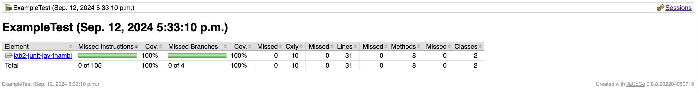

# SOEN 345 Lab 2 - JUnit Testing

**Name**: Sanjay Thambithurai 
**Student ID**: 40184405 

## Description

Lab exercise to write an Example Calcular Function and Example test to check with JUnit tests. The JUnit tests achieve at least 80% branch coverage.

## How to Run Tests

To run the JUnit tests for the `Example` class:
1. Open the project in Eclipse.
2. Right-click on `ExampleTest.java`.
3. Select **Run As** > **JUnit Test**.

## Reflections

I learned how to use JUnit for testing and code coverage!

